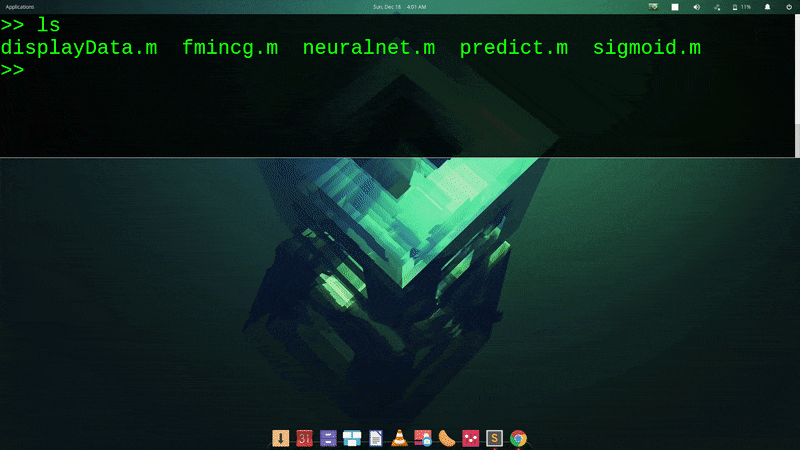
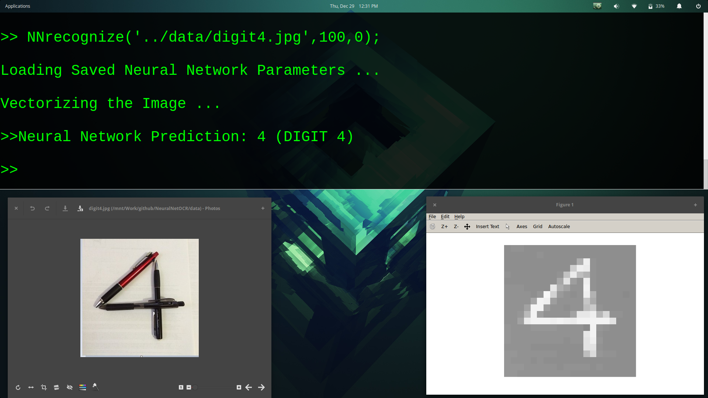

# NeuralNetOCR
A Neural Network trained for Optical Character Recognition 

### Handwritten Digit Recognition 

#### Training Set Accuracy: *97.52%*

### Pattern Digit Recognition 

### Vectorized Implementation of y Labels to Y matrix

I have implemented an interesting vectorized method to compute the multi-class representation of y matrix from the label vector y.

This algorithm works both in MATLAB and Octave. It is clear and expansive but easy to understand.
And this is m times faster, where m is the number of examples than the standard loop method.

	

In simple intuitive steps what we do is use y labels to index into the Y matrix and change those elements / features into 1.